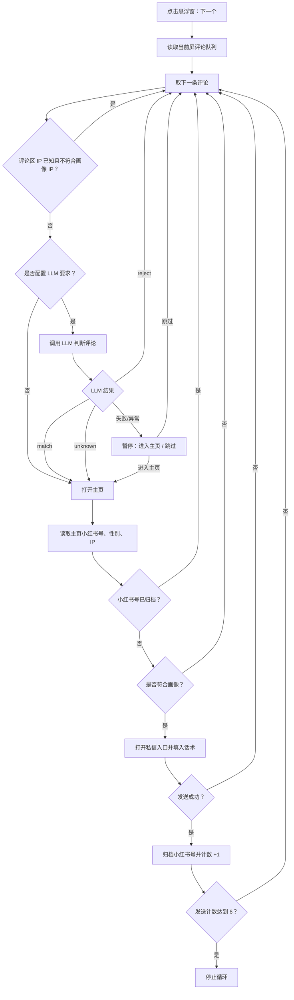

# CommentHelper

CommentHelper 是一个 Android 辅助工具，用于在小红书评论区中按用户画像筛选评论作者，并辅助进入主页、读取公开信息、填入固定话术、归档发送记录和做基础数据分析。

## 当前功能

- 画像设置
  - 配置固定话术。
  - 配置目标性别和目标 IP。
  - 配置自然语言“要求”，用于 LLM 对评论内容做预筛选。
  - 配置 DeepSeek API Key；未配置时不启用 LLM 预筛。
- 悬浮窗流程
  - 在小红书页面上方显示悬浮球。
  - 读取当前屏已加载的评论和回复。
  - 评论队列按昵称展示，当前项高亮。
  - 点击“下一个”后循环处理队列。
  - 队列消费完后滑动到下一区域并重新读取。
- 用户匹配
  - 评论区 IP 已暴露且不符合画像 IP 时，直接跳过。
  - 配置了“要求”时，会调用 DeepSeek 对评论内容做预筛选。
  - LLM 返回 `reject` 时直接跳过。
  - LLM 返回 `match` 时进入主页，后续只校验主页 IP。
  - LLM 返回 `unknown` 时进入主页，继续使用主页性别和 IP 判断。
  - LLM 请求失败或返回异常时暂停，悬浮窗提供“进入主页 / 跳过”选择。
  - 主页小红书号已归档时跳过私信入口，避免重复发送。
- 私信辅助
  - 匹配成功后尝试打开主页上的“发私信”入口。
  - 自动填入固定话术。
  - 尝试点击发送按钮。
  - 发送成功计数，达到 6 次后停止循环。
- 归档管理
  - 发送成功后按小红书号归档。
  - 小红书号作为唯一主键，重复保存会更新记录。
  - 支持新增、编辑、删除归档记录。
  - 支持对归档记录标记：未标记、成功、失败。
  - 失败原因使用固定下拉选项：不理人、不想找了、卡年龄、我不会说话、卡颜、卡 IP。
  - 归档列表分页展示，每页 5 条。
- 数据分析
  - 半环形图统计成功、失败、未标记数量。
  - 柱状图统计失败原因分布。

## 页面结构

App 主界面底部包含三个 Tab：

- `画像设置`：配置辅助功能权限、固定话术、用户画像和 LLM 要求。
- `归档管理`：维护小红书号归档记录、判断结果和失败原因。
- `数据分析`：查看标签结果分布和失败原因分布。

## 权限

- 辅助功能权限：读取当前屏幕无障碍节点，识别评论、主页公开信息、私信输入框和按钮，并执行点击、返回、滑动等辅助操作。
- 悬浮窗权限：在小红书 App 上方显示悬浮球和操作面板。
- 网络权限：调用 DeepSeek Chat Completions 接口进行评论预筛选。

## 基本使用流程

1. 打开 CommentHelper。
2. 按提示开启悬浮窗权限。
3. 在 `画像设置` 中开启辅助功能权限。
4. 配置固定话术。
5. 配置目标性别、目标 IP、“要求”和 DeepSeek API Key。
6. 打开小红书，进入目标帖子的评论区。
7. 点击悬浮球展开面板。
8. 点击“下一个”，工具会读取当前屏评论并开始循环处理。
9. 如 LLM 判断失败或异常，按悬浮窗提示选择“进入主页”或“跳过”。
10. 发送成功后记录会写入 `归档管理`。
11. 在 `归档管理` 中维护判断结果和原因。
12. 在 `数据分析` 中查看统计图表。

## 匹配逻辑概览



## 技术说明

- 平台：Android
- 语言：Kotlin
- UI：XML View + Material Components
- 存储：DataStore Preferences，归档数据以 JSON 数组保存
- 自动化能力：Android Accessibility Service
- 图表：自定义 Canvas View
- LLM：DeepSeek Chat Completions

## 构建

```powershell
.\gradlew.bat :app:testDebugUnitTest
.\gradlew.bat :app:assembleDebug
```

Debug APK 输出位置：

```text
app/build/outputs/apk/debug/app-debug.apk
```

## 注意事项

- 工具只读取当前屏幕无障碍树中公开展示的信息，不做接口抓取或逆向。
- 性别和 IP 主要来自小红书页面公开显示的无障碍文本、描述或控件信息；未暴露时可能无法识别。
- LLM 只做评论内容预筛选，最终是否发私信仍会经过主页信息判断。
- 归档只保存小红书号、判断结果、原因和时间信息。
- DeepSeek API Key 在页面中配置并保存在本机 DataStore 中；未配置时会跳过 LLM 预筛。
- 请合理使用辅助能力，避免骚扰或批量滥用。
